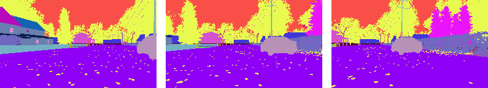

#  Using imitation learning to drive a car in AirSim
The agent was trained to drive around a block in the neighbourhood environment from <a href="https://microsoft.github.io/AirSim/">AirSim</a>.\
The human driver recorded the view from three cameras using segmented images:

    

For that, the *settings.json* file has to be moved into the AirSim directory.

Finally the model was trained to imitate the human driver,\
correcting the steering label for the left and right view to get back on track [<a href="https://arxiv.org/abs/1604.07316">Bojarski et al. ‘16, NVIDIA</a>].\
Watch it drive:

    

