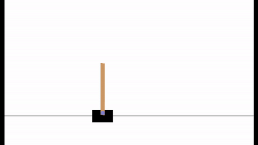
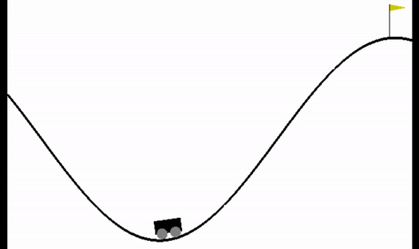

# Solving Gym environments with reinforcement learning
Using Python, Tensorflow and Tensorboard to solve Gym environments.
With *train.py*, setting *game* to the specific environment, the gym environment can be solved using reinforcement learning (using double q-learning with e-greedy/e-anneal or boltzmann).
The learned model can then be tested using *test.py*, again specifying the environment with *game*.

## Cartpole

## Mountaincar
