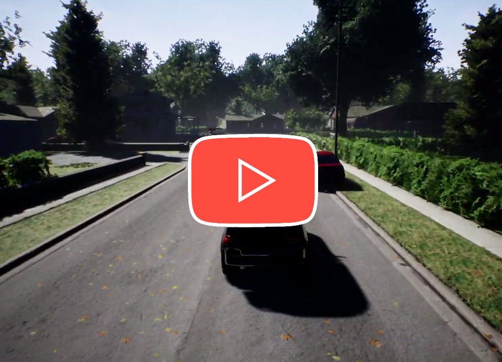

#  Using imitation learning to drive a car in AirSim
The Agent was trained to drive around a block in the neighbourhood scene in AirSim.\
Using imitation learning the Nvidia three camera approach has been used [Bojarski et al. ‘16, NVIDIA].\
The human driver recorded the view from three cameras using the segmented images:

    

For that the *settings.json* file has to be moved into the AirSim directory.

Finally the model was trained to imitate the human driver, correcting the steering label for the left and right view to get back on track.\
Watch it drive:

    

<!-- **This is just a quick project, falling short of extensive network search.** -->