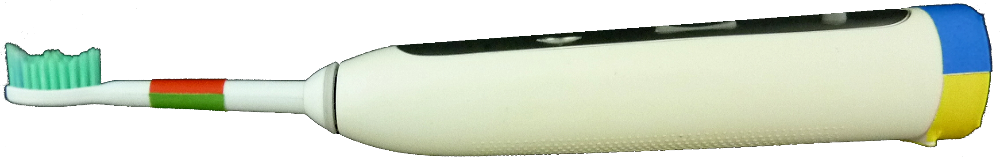

# Android-App   for detecting the brushed   quad, tooth and surface
Using a specially preparated toothbrush, as shown below, the app can detect its colors using openCV.

By additionally detecting the users eyes the quadrant schema can be layed over.

This quadrant schema gets positioned and appropriately sized with the help of the two detected eyes and their distance.\
Directly detecting the users mouth didn't show success as the mouth is mostly covered in the process of toothbrushing.

The brushed tooth is detected by analysing the distance of the outer toothbrush-mark to the calculated mouth center.\
As the "travelled" distance of the toothbrush-end isn't linear\
(going from the first tooth to the second has a much higher distance as from the 7th to the last)\
a parabola has been used to project the linear division into a more realistic distribution.

After detecting the quadrant and tooth, the brushed surface can be calculated.\
This is done by comparing the two different mark colors.\
By analysing their color "volume" and positioning relative to each other the brushed surface can be calculated, additionally allowing to second check the previous quad and tooth results.

Shown below is a full analysis output, with the edgepoints of the schema and the detected brush colors.\
The calculated brushed quad,tooth and surface are shown in the top left corner.

The actual code is located here:
(https://github.com/AntoineSchmidt/Portfolio/tree/master/projects/modal5/code/app/src/main/java/hs_kempten/ibrush/)