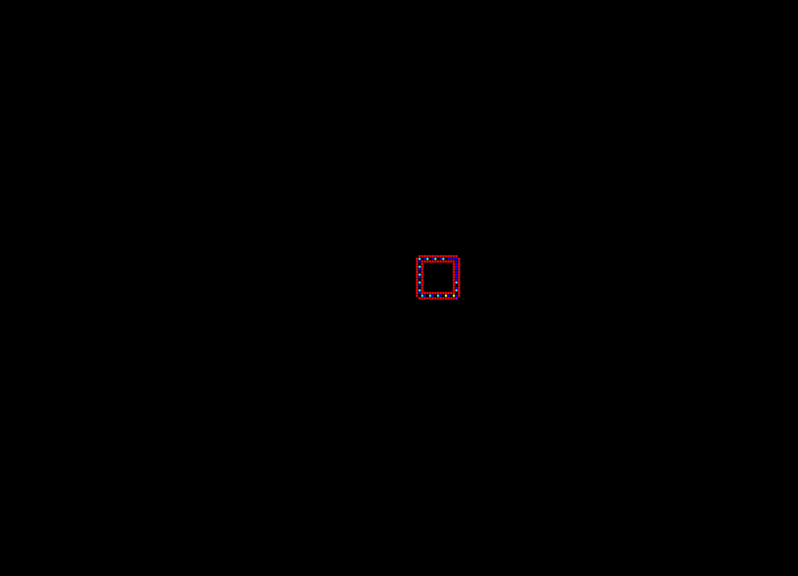

#  Self-reproduction with cellular automata in C++
This team-project simulates cellular automata on a grid.\
(SELF-REPRODUCTION IN CELLULAR AUTOMATA by Christopher G. LANGTON)

This project is:
- using the boosted library for multithreading
- highly configurable, able to simulate automata on a n-dimensional grid
- implementing the observer class-structure for multiple output (bmp images, sdl window, console)

## Langton Loops

## Evoloops

## Run the simulation
*alife.exe data.xml setting-id*\
All automata rules, the world (initial state, size, dimension) and the wanted outputs (bmp images, sdl window, console) can be configurated in a xml file.\
Checkout data.xml and data_lab.xml for examples.\
*linux_dependencies.txt* states all dependencies needed using linux.